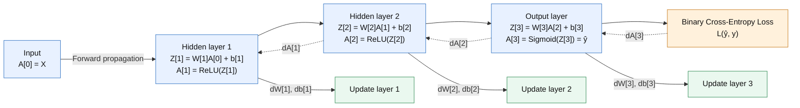

# Forward and backward propagation

```mermaid
flowchart LR
    X["Input<br/>A[0] = X"]

    H1["Hidden layer 1<br/>Z[1] = W[1]A[0] + b[1]<br/>A[1] = ReLU(Z[1])"]

    H2["Hidden layer 2<br/>Z[2] = W[2]A[1] + b[2]<br/>A[2] = ReLU(Z[2])"]

    OUT["Output layer<br/>Z[3] = W[3]A[2] + b[3]<br/>A[3] = Sigmoid(Z[3]) = ŷ"]

    LOSS["Binary Cross-Entropy Loss<br/>L(ŷ, y)"]

    X -->|"Forward propagation"| H1
    H1 --> H2
    H2 --> OUT
    OUT --> LOSS

    LOSS -. "dA[3]" .-> OUT
    OUT -. "dA[2]" .-> H2
    H2 -. "dA[1]" .-> H1

    OUT -->|"dW[3], db[3]"| U3["Update layer 3"]
    H2 -->|"dW[2], db[2]"| U2["Update layer 2"]
    H1 -->|"dW[1], db[1]"| U1["Update layer 1"]

    classDef forward fill:#e8f1ff,stroke:#3978c5,color:#111;
    classDef loss fill:#fff1dc,stroke:#c98028,color:#111;
    classDef update fill:#eaf8ef,stroke:#39915d,color:#111;

    class X,H1,H2,OUT forward;
    class LOSS loss;
    class U1,U2,U3 update;
```
